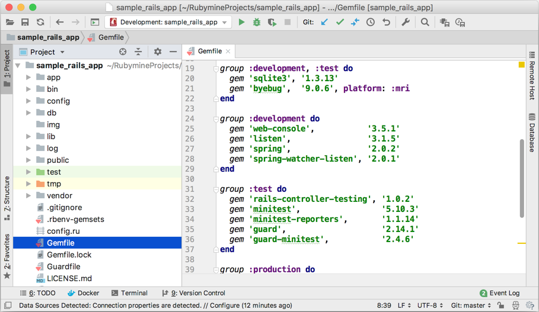

# Ruby on Rails Tutorial sample application

This is a fork of the [*Ruby on Rails Tutorial*](http://www.railstutorial.org/) application by Michael Hartl. We created this project to help you try [RubyMine](https://www.jetbrains.com/ruby/) features described in our [documentation](https://www.jetbrains.com/help/ruby/).

## Help page

For general help on the Rails Tutorial, see the [Rails Tutorial Help page](https://www.railstutorial.org/help).

## License

All source code in the project is available jointly under the MIT License and the Beerware License. See [LICENSE.md](LICENSE.md) for details.

## Getting started

To get started with the app, follow this step-by-step tutorial: [Get Started](https://www.jetbrains.com/help/ruby/get-started.html)